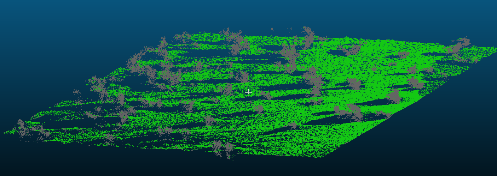

Extract geometry features from 3D point clouds

# Content

The project contains the following folders:

+ [geo3dfeatures](./geo3dfeatures) contains source code
+ [docs](./docs) contains some mardown files for documentation purpose and
  images
+ [examples](./examples) contains some Jupyter notebooks for describing data
+ [tests](./tests); `pytest` is used to launch several tests from this folder

Additionally, running the code may generate extra subdirectories in a chosen
data repository (`./data`, by default).

# How to install

This projects runs with Python3, every dependencies are managed
through [poetry](https://poetry.eustace.io/).

## Installation from source

```
$ git clone ssh://git@git.oslandia.net:10022/Oslandia-data/geo3dfeatures.git
$ cd geo3dfeatures
$ virtualenv -p /usr/bin/python3 venv
$ source venv/bin/activate
(venv)$ poetry install
```

# Run commands

Six commands are currently available:

```
geo3d info -h
geo3d sample -h
geo3d index -h
geo3d featurize -h
geo3d profile -h
geo3d cluster -h
```

## Info

This first program provides basic informations about an input point cloud file.

```
geo3d info -d <datapath> -i <input-file>
```

## Sample

This program aims at generating small subsets of data starting from a raw
`.las` file.

It considers a input file located in a specified data folder, read it, and
write a lighter dataset that contains the given point quantity:

```
geo3d sample -d <datapath> -i <input-file> -p <sample-points>
```

## Index

This program aims at computing a kd-tree on a given-as-argument point cloud, in
order to pre-compute local neighborhoods. This information will be useful for
the next step, *i.e.* featurization.

The `index` program can be used as follows:

```
geo3d index -d <datapath> -i <input-file> -e <experiment> -t <tree-leaf-size>
```

## Featurize

The `featurize` program is focused on geometric feature generation, given a raw
3D point cloud.

By considering an input file in the given data folder (whose columns must be
explicited), a set of some geometric features are generated on a subset of the
point cloud, given a kd-tree method parametrized by a number of neighoring
points and a leaf size. A name may also be provided to the experiment, for a
sake of clarity.

```
geo3d featurize -c <input-columns> -d <datapath> -e <experiment> -i <input-file> -n <nb-neighbors> -p <sample-points> -t <kd-tree-leafs> --chunksize <chunk-size>
```

## Profile

The third program is highly linked to the previous one, as it postprocess time
measurements. Such measurements are produced by `pstats` when running
`featurize` with the `./time-measurement.sh` program.

This program only refers to the experiment name (in order to retrieve the
accurate measurements in subfolders), and produces `csv` or `json` output
files.

```
geo3d profile -e <experiment> -F <file-format>
```

## Cluster

The `cluster` program consider the outputs of `featurize` so as to classify
points of the 3D point cloud.

It first retrieves the features saved in the data folder, under specific
experiment name, feature set, number of neighbors and number of sampled
points. Then, it runs a k-means clustering by considering a given number of
clusters.

```
geo3d cluster -d <datapath> -e <experiment> -n <nb-neighbors> -p <sample-points> -k <nb-clusters>
```

# Extras

Some extra documentation is also available, that describes the set of
considered geometric features, the fixtures (*i.e.* dummy datasets) used for
test purpose and a practical pipeline use case:

- [Feature set](./docs/features.md)
- [Test fixtures](./docs/test_fixtures.md)
- [Command pipeline](./docs/pipeline.md)

# Examples

The following example has been generated starting from
a [CANUPO](http://nicolas.brodu.net/en/recherche/canupo/) dataset (file `scene.xyz`, with 500k points, 50 neighbors and all the features):



___

Oslandia, march 2019
