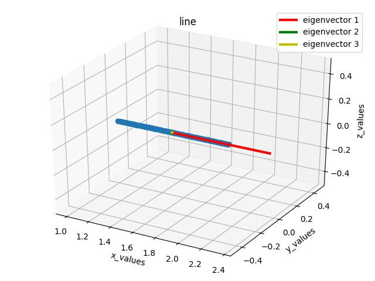
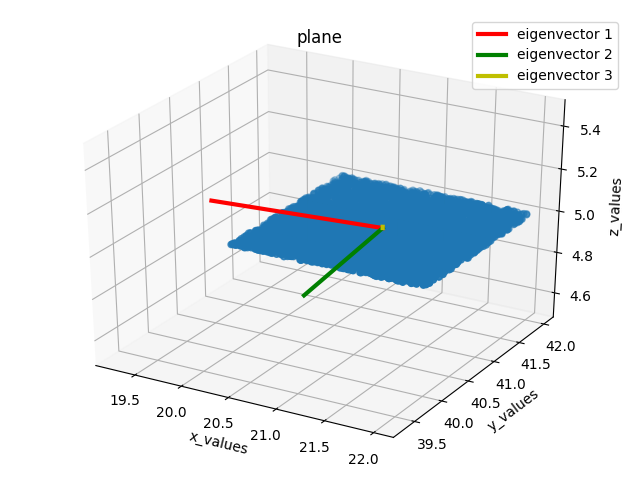
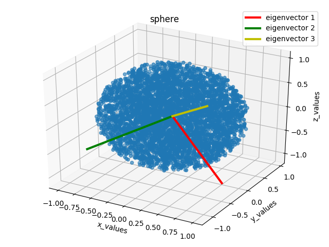
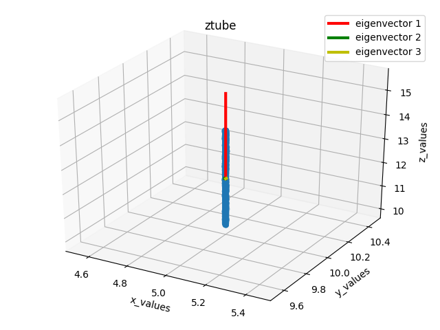
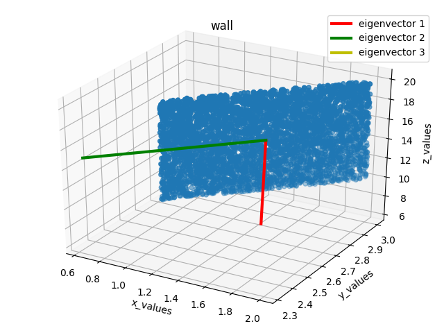
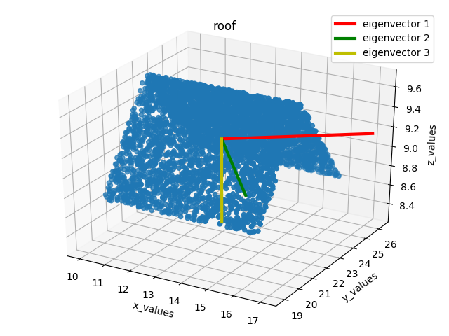

# Test fixtures

This document aims at characterizing and giving more details about fixtures
used in [test modules](./tests/test_features.py), in order to clarify the
philosophy of feature testing.

Six point clouds with simple shapes have been drawn in order to describe basic
geometric patterns. There is respectively lines, planes, spheres, vertical
tubes, walls and roofs.

## line

The simple geometric shape is the 1D-line.

Defined only over x-axis, it does not imply any 2D or 3D
characteristic. Regarding the point cloud decomposition, one has only one high
eigenvalue denoting the distribution of points over the x-axis. Other
eigenvalues are negligible (hence the two less important vectors do not appear
on the figure). The eigenvector that corresponds to the highest eigenvalue is
oriented along the line.

## plane

Considering a plane-shaped point cloud, one has to expect a strong 2D spreading
around x- and y- axis.

By depicting the point cloud eigenvectors, this characteristic is confirmed, as
the third eigenvalue looks negligible. The two main eigenvectors draw a
2D-space along the x-y plane, and both vectors are of comparable importance.

## sphere

The sphere is the archetypal 3D point cloud, with a equal repartition of values
along the three axis.

Drawing eigenvectors provides a view of the three dimension balanced
importance: one has three orthogonal vectors of comparable length.

## ztube

The vertical tube is a particular case of 1D-line, where points are spreading
along the z-axis, instead of the x-axis.

As for the line case, one has only one significant eigenvalue, that is
associated with a fairly vertical eigenvector.

This particular fixture will be used for highlighting verticality.

## wall

The wall fixture is a particular case of the plane. Walls may generally be
defined with only two coordinates (`z`, plus `x`, `y` or a linear combination
of `x` and `y`), one can resume the point cloud information by a 2D
representation.

Indeed, there are only two significant eigenvalues in such cases, and
eigenvectors draw a 2D-plane that follows the point spatial distribution.

## roof

The roof-shaped point clouds come as a last base fixture. This is a
3D-structure composed of two sloping plane.

There is no "negligible" eigenvalue, strictly speaking. However the third
eigenvalue is significantly smaller than the first ones. Third 3D-shaped type
of point cloud will be characterized by a particular set of geometric features
(as an example: verticality coefficient of roofs are close to 0).

It has to be noted that depending on the point cloud resolution, such pattern
may be rare.
